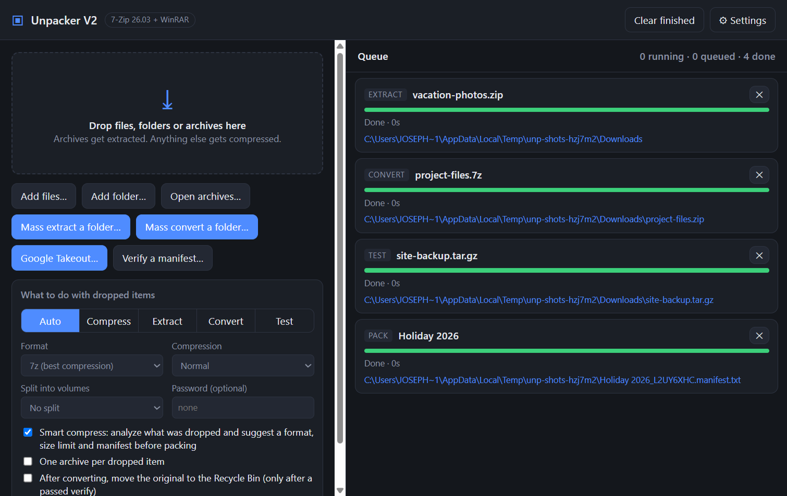
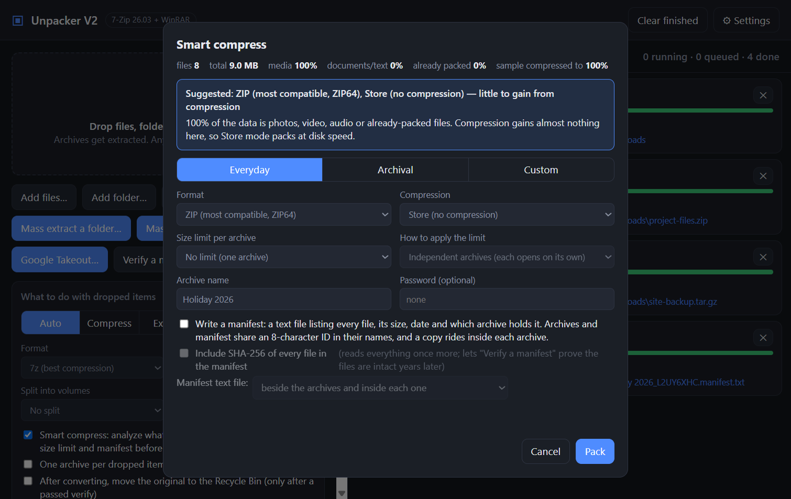
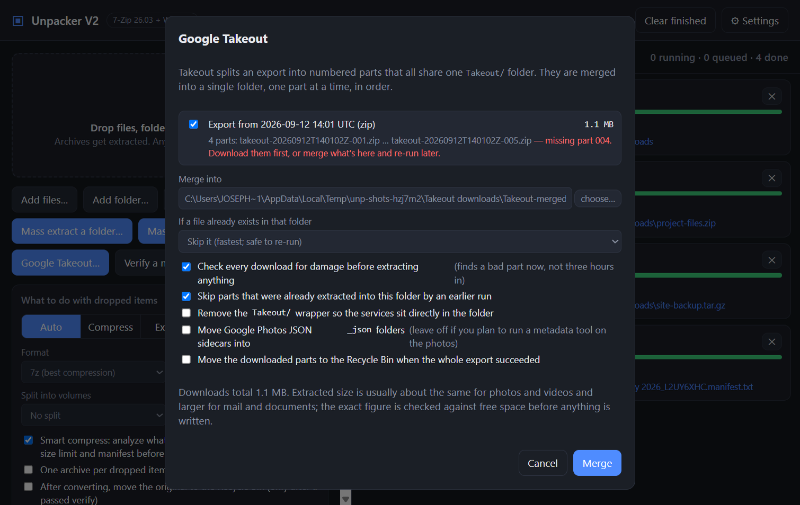
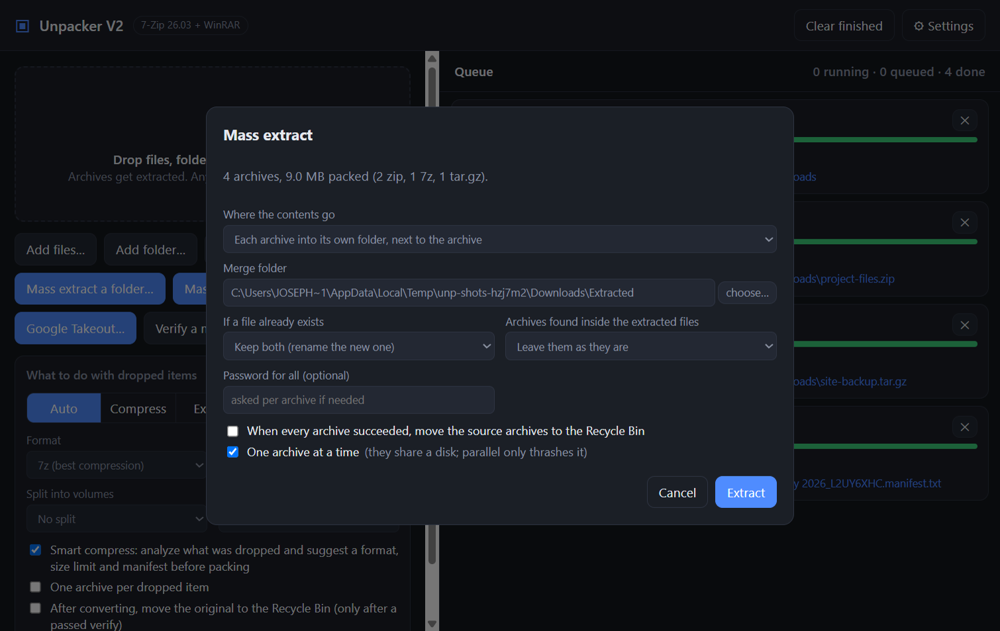
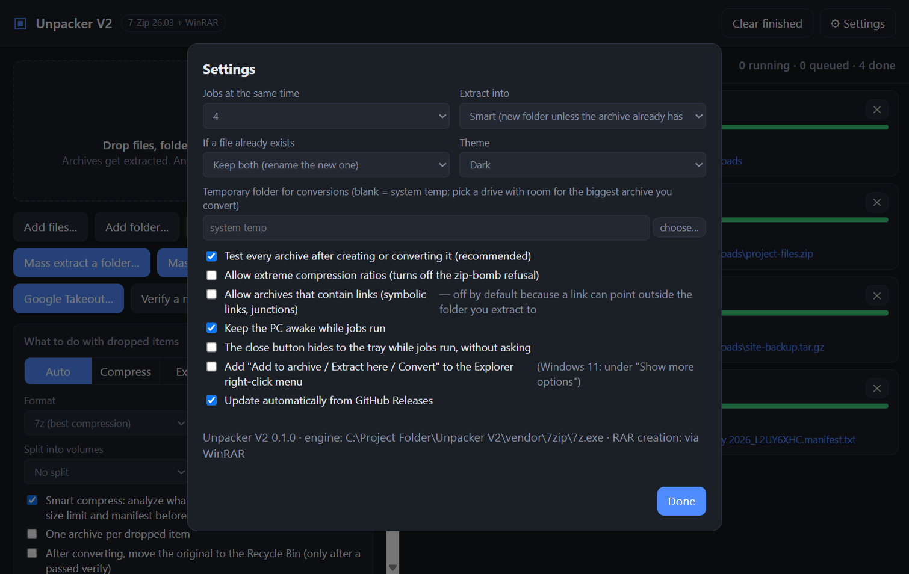

# Unpacker V2



A drag-and-drop Windows archiver that stays out of your way: drop archives to
extract them, drop anything else to compress it, or point it at a folder and
convert every archive inside to one format. Built on the 7-Zip engine, so
ZIP/ZIP64, 7z, tar, gzip, bzip2, xz, zstd, cab, iso, wim and RAR (extract)
all just work, on files of any size.

## What it does

- **Create** 7z, ZIP (ZIP64, AES-256), tar, tar.gz, tar.xz, tar.bz2 — and RAR
  if you have WinRAR installed.
- **Extract** everything 7-Zip reads, including RAR/RAR5, split volumes
  (`.001`, `.part1.rar`, `.z01`), and encrypted archives (it asks for the
  password instead of failing).
- **Mass convert** — drop a stack of archives, or scan a whole folder, and
  repack them all as 7z/ZIP/tar.*; verified before the original is touched.
- **Mass extract** — point it at a folder of mixed ZIP/RAR/7z/tar.* (or drop
  several archives, or right-click a folder in Explorer). Each archive into
  its own folder, everything merged into one folder, or contents next to each
  archive. Archives found inside the extracted files can be extracted too
  (and optionally binned), one at a time so the disk isn't thrashed. Sources
  go to the Recycle Bin only when every archive succeeded; a
  `Mass-extract-report.txt` says what happened.
- **Test** archive integrity.
- **Smart compress** — drop files in Compress mode and the app analyzes them
  (what they are, plus how well a sample actually deflates) and suggests a
  format and level with a reason: Store for photos/video, solid 7z for
  documents, capped solid blocks for mixed sets. Presets: Everyday, Archival,
  Custom.
- **Size limits** — 1, 2, 4 (FAT32-safe), 10, 20 or 50 GB per archive, as
  *independent archives* (each opens on its own; folders kept together where
  they fit) or as *volumes* of one archive. A single file bigger than the
  limit becomes its own volume set automatically.
- **Manifests** — an 8-character ID links archives and a text manifest:
  `Album_K7M3Q9XZ-01of03.7z` … `Album_K7M3Q9XZ.manifest.txt`, listing every
  file, size, date and which archive holds it, optionally with SHA-256. A copy
  rides inside each archive. **Verify a manifest** later checks every archive
  is present and intact and, with hashes, that every file is byte-for-byte
  what was archived.
- **Google Takeout** — point it at your downloads folder (or drop the parts)
  and it groups the numbered parts into exports, flags missing parts, checks
  every download for damage first, checks disk space for the whole export,
  then merges the parts one at a time into a single folder. Interrupted runs
  resume. Options: skip/overwrite/keep-both on collisions, drop the `Takeout/`
  wrapper, tidy Google Photos JSON sidecars into `_json` folders, Recycle-Bin
  the parts when done. A `Takeout-import-report.txt` lands in the folder.
- Password / AES encryption, split volumes (FAT32-safe 4 GB preset), verify
  after every job, per-job cancel, a bounded parallel queue.
- Optional Explorer right-click entries: *Add to archive*, *Extract here*,
  *Extract to folder…*, *Convert archive…*.

## Built for jobs you walk away from

- Closing the window while jobs run asks: keep running in the tray, cancel
  and quit, or stay. A setting makes "hide to tray" the silent default.
- The PC is kept awake while the queue is busy (toggle in Settings).
- Cancel or failure removes half-written archives; chunks that already
  verified are kept. A manifest is only written once every archive is in.
- Archives containing symbolic links or junctions are refused unless you
  allow them, because a link can point outside the folder you extract to.
- Passwords never reach the window's job list. They are visible on the
  7-Zip/WinRAR command line while a job runs, like every archiver.
- Inputs inside OneDrive, Google Drive, Dropbox or iCloud folders get a
  warning: cloud-only placeholders download as they are read.
- Jobs that finish with warnings turn amber and list them; duplicates
  already in the queue are skipped.

## What it deliberately won't do

- **Create RAR without WinRAR.** Only rar.exe can write RAR and its licence
  forbids bundling it. Extracting RAR needs nothing extra.
- Extract an archive whose entries point outside the destination folder, or
  one that looks like a zip bomb (>1000:1 and >1 GB), unless you turn that
  guard off in Settings.
- Delete anything with `unlink`. "Remove original" means the Recycle Bin, and
  only after the new archive passed an integrity test.

## Run from source

Needs Node 22+ (Node 24 works; there are no native modules).

```bash
npm install
npm run dev
```

The 7-Zip engine is expected at `vendor/7zip/7z.exe` + `7z.dll` (or an installed
7-Zip in Program Files). Get it from <https://www.7-zip.org/download.html>:
install 7-Zip, then copy `7z.exe`, `7z.dll` and `License.txt` from
`C:\Program Files\7-Zip` into `vendor/7zip/`. 7-Zip is LGPL; the RAR
decompression code inside it carries the unRAR restriction (it may not be used
to build a RAR *compressor*), which this app respects.

```bash
npm test          # node --test, pure modules only
npm run dist      # dist/unpacker-v2-<ver>-setup.exe
```

## Documentation

- [User guide](docs/USER-GUIDE.md) — every flow, with screenshots.
- [Project site](https://axialforge.github.io/unpacker-v2/) — the same, prettier.
- [CHANGELOG](CHANGELOG.md) and [what's planned](docs/DESIGN-NEXT.md).
- [CLAUDE.md](CLAUDE.md) — architecture, invariants and the gotchas that cost
  real debugging time. Read it before changing anything.

## Screens

| Smart compress | Google Takeout |
| --- | --- |
|  |  |

| Mass extract | Settings |
| --- | --- |
|  |  |

## Install

Grab the latest `unpacker-v2-<version>-setup.exe` from
[Releases](https://github.com/AxialForge/unpacker-v2/releases/latest). One-click,
per-user install (no admin), silent auto-update from GitHub Releases.
The build is unsigned; SmartScreen will warn the first time.

## Licence

MIT. Bundled 7-Zip is © Igor Pavlov, LGPL + unRAR restriction; see
`vendor/7zip/License.txt`.
