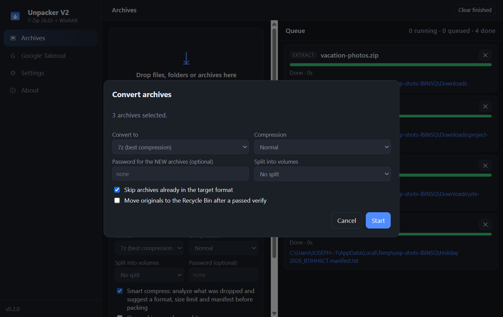
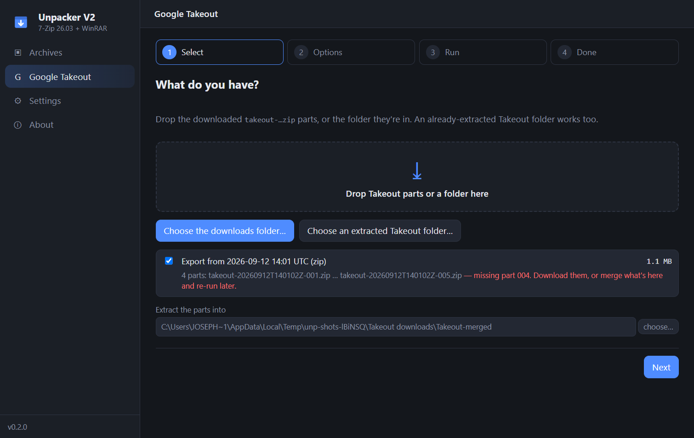

# Unpacker V2 — user guide

Unpacker V2 is a Windows archiver built on the 7-Zip engine. Drop archives to
extract them, drop anything else to compress it, or point it at a folder to
work on everything inside. This guide walks through each flow.


## Install

Download `unpacker-v2-<version>-setup.exe` from the
[Releases page](https://github.com/AxialForge/unpacker-v2/releases/latest) and
run it. It installs per-user (no administrator prompt) and updates itself
silently from GitHub Releases; you can turn that off in Settings. The build is
not code-signed, so Windows SmartScreen shows a warning the first time. Click
"More info", then "Run anyway".

No 7-Zip install is needed; the engine ships inside. If WinRAR is installed,
Unpacker V2 can also *create* RAR files through it. Extracting RAR needs
nothing extra.

## The main window

The sidebar on the left switches between **Archives** (the queue and the
compress/extract tools), **Google Takeout** (the guided wizard), **Settings**
and **About**. The sidebar footer shows the version and, while jobs run,
whether the PC is being kept awake.

- **Drop zone.** Drop files, folders or archives. In **Auto** mode archives
  are extracted and everything else is compressed.
- **Buttons.** *Add files*, *Add folder* and *Open archives* do the same via a
  picker. *Mass extract*, *Mass convert*, *Google Takeout* and *Verify a
  manifest* open the flows described below.
- **What to do with dropped items.** Switch Auto to *Compress*, *Extract*,
  *Convert* or *Test* to force one action. Format, compression level, split
  size and password apply to compress and convert.
- **Queue.** Every job is a row with a progress bar, its stage, the current
  file, and Cancel. Finished rows link to the output; click it to show the
  file in Explorer. Rows that finished with warnings turn amber and list them.

## Extracting

Drop an archive, or right-click one in Explorer and choose *Extract here* or
*Extract to folder…* (enable the Explorer entries in Settings). Everything
7-Zip reads is supported: ZIP, 7z, RAR and RAR5, tar and tar.gz/xz/bz2/zst,
cab, iso, wim, and more, including split sets (`.001`, `.part1.rar`, `.z01`).

**Where files go** is a setting: *Smart* makes a new folder named after the
archive unless the archive already contains a single top-level folder; *Always
a new folder*; or *Right where the archive is*.

**Encrypted archives** are detected up front. The job pauses with "Password
needed" and asks; a wrong password asks again instead of failing.

**Protection.** An archive whose entries point outside the destination
(`../`, absolute paths) is refused. So is one that expands more than 1000:1
into more than 1 GB (a zip-bomb pattern) unless you allow it in Settings, and
so is one that contains symbolic links or junctions, for the same reason.

## Compressing (Smart compress)

Drop files or a folder. With *Smart compress* on (the default), the app
analyzes what you dropped and suggests a format:


- Photos, video, audio and already-packed files get **Store** mode in ZIP,
  since compression gains almost nothing and Store runs at disk speed. With a
  password it suggests 7z, because ZIP can't hide file names.
- Documents, text, code and mail get **7z** at a higher level; expect several
  times smaller than ZIP.
- Mixed content gets 7z Normal with solid blocks capped at 256 MB so a
  damaged block can't take the whole archive with it.

Three presets: **Everyday** takes the suggestion with no manifest. **Archival**
adds a manifest with SHA-256 of every file and a 4 GB size limit for large
sets. **Custom** lets you set everything.

**Size limit per archive** (1, 2, 4, 10, 20 or 50 GB) works two ways:

- *Independent archives*: files are grouped so each archive stays under the
  limit and opens on its own. Folders are kept together when they fit. A
  single file larger than the limit becomes its own volume set automatically.
- *Volumes of one archive*: `.001`, `.002`, … pieces. Every piece is needed
  to open it.

**Manifest.** An 8-character ID links archives and a text file:

```
Album 2026_K7M3Q9XZ-01of03.zip
Album 2026_K7M3Q9XZ-02of03.zip
Album 2026_K7M3Q9XZ-03of03.zip
Album 2026_K7M3Q9XZ.manifest.txt
```

The manifest lists every file, its size, date and which archive holds it,
optionally with its SHA-256. A copy rides inside each archive, so losing the
text file loses nothing. Choose *inside the archives only* to avoid a plain-
text list of names beside an encrypted set.

**Verify a manifest** later checks that every archive is present and intact
and, when hashes are there, that every file is byte-for-byte what was
archived. Pick the `.manifest.txt`, or any of the archives. A `.verify.txt`
report lands beside them.

Turn *Smart compress* off in the options panel to compress straight away with
the format shown there.

## Mass extract

Click *Mass extract a folder…*, drop three or more archives at once, or
right-click a folder in Explorer and choose *Extract all archives in here…*.


- **Where the contents go.** Each archive into its own folder next to it;
  everything merged into one folder; or contents next to each archive.
- **If a file already exists** in the merge folder: keep both, skip, or
  overwrite.
- **Archives found inside the extracted files.** Leave them; extract them
  too and keep the nested archive; or extract them too and send the nested
  archive to the Recycle Bin. Up to three levels deep.
- **Recycle Bin the sources** only when every archive succeeded. One failure
  keeps everything.
- **One archive at a time** is on by default; they share a disk.

A summary card at the top of the queue tracks the batch and offers *Cancel
remaining*, then *Report* and *Open folder* when done. A
`Mass-extract-report.txt` is written beside the archives or in the merge
folder.

## Mass convert

Click *Mass convert a folder…* or set the action to *Convert* and drop
archives. Pick the target format, level, optional password for the new
archives and split size. Each archive is unpacked to a temporary folder,
repacked, integrity-tested, and only then is the original moved to the
Recycle Bin (if you asked for that). RAR files convert to any format; RAR can
be a target only when WinRAR is installed.



## The Google Takeout tab

The **Google Takeout** tab at the top of the window is a guided, four-step
flow for the whole job: check the downloads, extract them, and organize the
result into clean libraries.



1. **Select.** Drop the `takeout-…zip` parts or the folder they're in, or
   point at a folder you already extracted. Each export is listed with its
   part count and size; missing parts and browser re-downloads
   (`…-028 (1).zip`) are called out. Multi-set exports (`…-2-001.zip`) are
   grouped per set.
2. **Options.** Extraction: damage check first, resume, collision policy,
   Recycle-Bin the parts when done. Organizing: where the library goes and
   what to do per service.
3. **Run.** A rail shows Check → Extract → Organize with live progress. Cancel
   is one click; nothing half-done is left behind.
4. **Done.** A summary, and buttons to open the library and the report.

**What organizing does**

- **Google Photos** become `Library/Photos/YYYY/MM/…`. Each photo's date is
  read from Google's JSON sidecar and applied to the file's modified time.
  JPEGs that carry no EXIF date get the taken time written into EXIF, so the
  date survives copying. The same photo repeated across albums is kept once
  (by content hash); album membership is written to `Photos/Albums.txt`.
  Sidecars move to `Photos/_json`, stay where they are, or go to the Recycle
  Bin, your choice. Files without a sidecar land in `Photos/Undated`.
- **Drive, Mail, Contacts, Calendar, YouTube and everything else** move into
  `Library/<Service>/…`, merged across all parts, with the tree intact. Any
  service can be excluded.
- Files are moved, not copied, when the library is on the same drive, so
  even a 300 GB export organizes in minutes. Nothing is deleted outright:
  duplicates and unwanted sidecars go to the Recycle Bin.
- A `Takeout-organize-report.txt` in the library lists the counts: media
  placed, dated, EXIF written, duplicates removed, sidecars without media
  (their photo is in a part you don't have yet).

The organizer also understands the mess a browser leaves: several per-part
folders each holding a `Takeout/`, next to a half-merged one. Point it at the
parent and all of them are gathered.

## The Google Takeout dialog (quick merge)

The older *Google Takeout…* button on the Archives tab merges parts without
organizing. Takeout splits an export into numbered parts,
`takeout-<date>-001.zip`, `-002.zip`, …, that all share one `Takeout/`
folder. Click *Google Takeout…* and pick your downloads folder, or drop the
parts.


The dialog lists each export it found with its part count and size, and
flags missing part numbers. Then:

1. Every part is integrity-checked **before** anything is written, so a bad
   download is found now, not hours in. The message names the part to
   re-download.
2. Free disk space is checked for the whole export.
3. Parts are extracted one at a time into one folder, in order.

Options: skip / overwrite / keep-both on collisions; remove the `Takeout/`
wrapper; move Google Photos JSON sidecars into `_json` folders (leave this off
if you'll run a metadata tool on the photos); Recycle-Bin the parts when the
whole export succeeded. Interrupted runs resume: parts already extracted into
that folder are skipped. A `Takeout-import-report.txt` lands in the folder.

## Settings


- **Jobs at the same time.** Default 2. Use 1 when source and destination
  are the same spinning disk.
- **Extract into / If a file already exists.** Defaults for plain extraction.
- **Temporary folder.** Conversions and hash verification stage files here.
  Pick a drive with room for the biggest archive you convert.
- **Test every archive after creating or converting it.** On by default.
  Doubles the time of a huge archival job; the price of knowing.
- **Allow extreme compression ratios / archives that contain links.** The two
  safety guards you can switch off.
- **Keep the PC awake while jobs run.** On by default.
- **Close button hides to the tray.** Otherwise closing while jobs run asks:
  keep running in the background, cancel and quit, or stay.
- **Explorer right-click menu.** Adds *Add to archive*, *Extract here*,
  *Extract to folder…*, *Convert archive…* and *Extract all archives in
  here…*. On Windows 11 they sit under "Show more options".
- **Update automatically** from GitHub Releases.
- **Updates section.** Shows the installed version, a *Check for updates
  now* button with live status, and *Restart to update* once a new version
  has downloaded. Updates are fetched over HTTPS and checked against the
  release's SHA-512.

## About

Version, the 7-Zip engine version and path, whether WinRAR was found for RAR
creation, links to the site, user guide, releases, changelog and issue
tracker, and the licence notes for the bundled components.

## Command line

The Explorer entries run these; you can too:

```
"Unpacker V2.exe" --compress <paths...>
"Unpacker V2.exe" --extract-here <archive>
"Unpacker V2.exe" --extract-to <archive>
"Unpacker V2.exe" --extract-all <folder>
"Unpacker V2.exe" --convert <archive>
"Unpacker V2.exe" --test <archive>
```

## Things to know

- Passwords are visible on the 7-Zip or WinRAR command line while a job
  runs, like every archiver built on them. They never appear in the window's
  job list.
- Inputs inside OneDrive, Google Drive, Dropbox or iCloud folders trigger a
  warning: cloud-only placeholder files download as they are read. Mark the
  folder "Always keep on this device" first.
- Cancelling removes any half-written archive. In a chunked pack, chunks that
  already verified are kept.
- RAR creation needs WinRAR; only rar.exe can write the format and its
  licence forbids bundling it.
